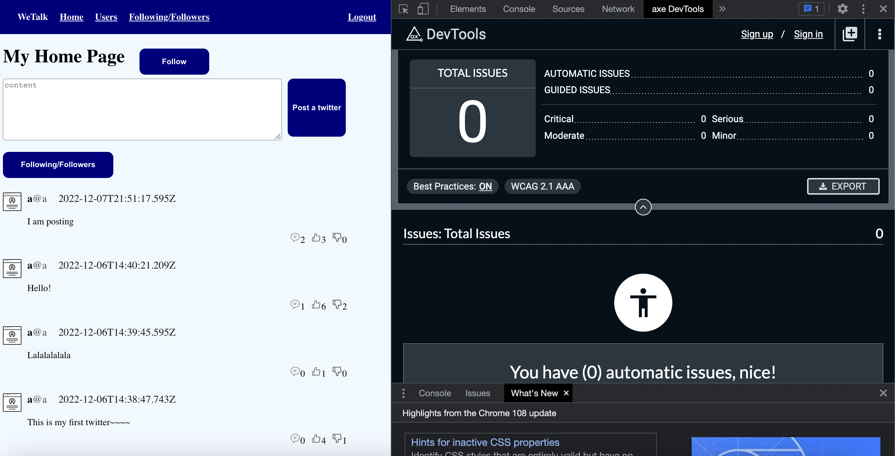
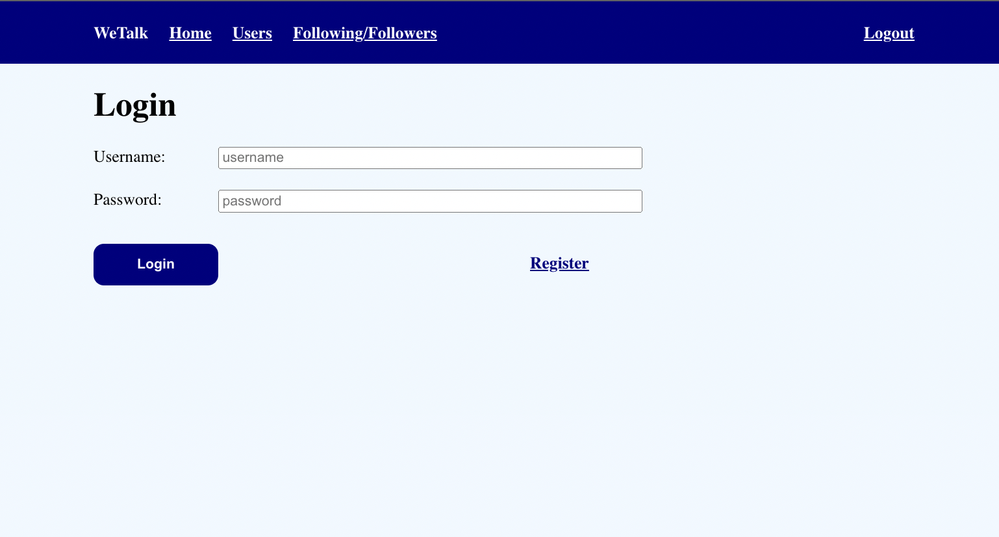
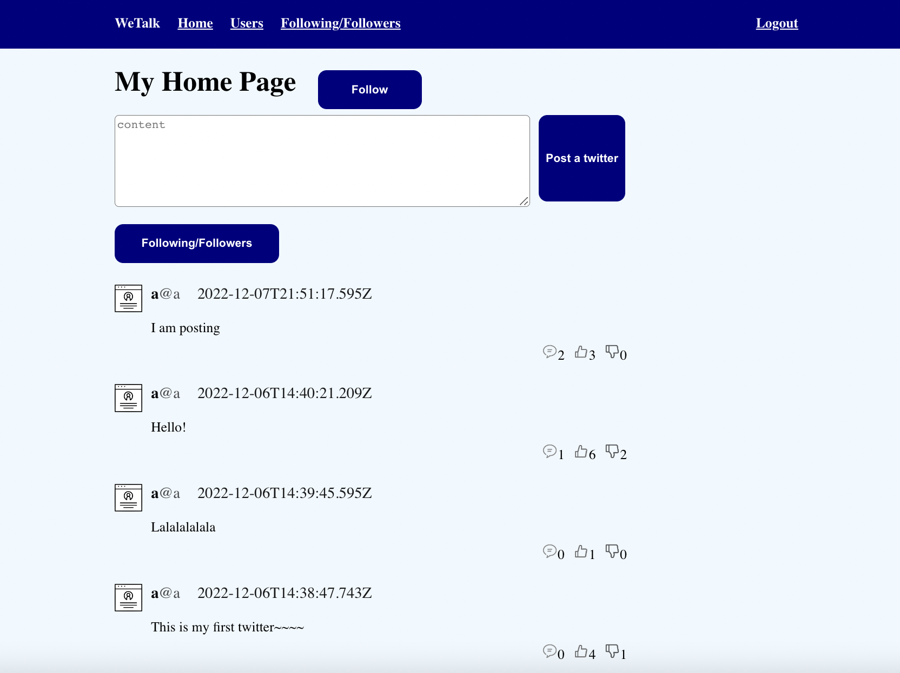
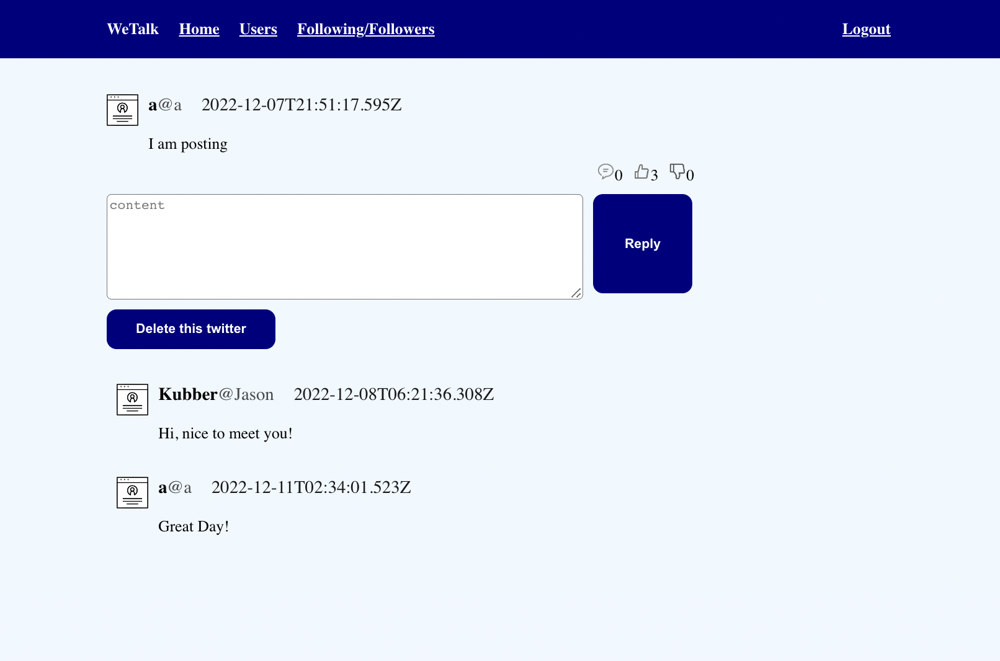
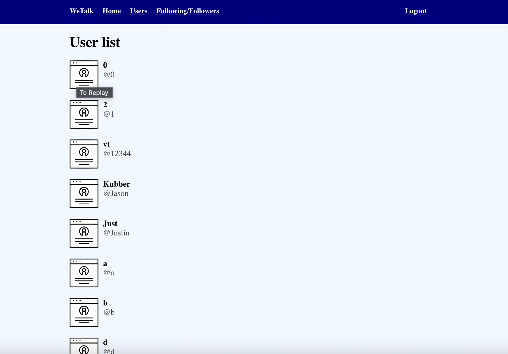

 
<h1 align="center">
WeTalk
</h1>
<p align="center">
React + Nodejs + Express + MongoDB + HTML5 + Heroku/render
</p>

Really good work. I see that a lot of efforts were put. I was initially not able to login/register on the deployed version of the app.

## Authors
Weihong Yang | Yuan Wang

## Deploy
- Project 4 version:  https://wetalk4.onrender.com
- Project 3 version:  https://wetalk123.herokuapp.com

## Defference: version 3 VS version 4.
* Passed “Axe” user accessibility Test
* Changed & align color palette with our web purpose       
    * Multiple color →  Serves for functional design
    * Align functional buttons with Dark blue and Dark grey.
    * Everything has been properly aligned and spaced.
    * Added a colored background. Plain→ off blue
    * Changed our fonts to serif typefaces. 
    * Assigned more spaces in Navibar design.
* To distinguish between “Login” and “Register”, retained the “Login” button, set “Register” button to clickable text pattern.
* Added trace cursor on the certain spot, it will be triggered automatically once our mouse cursor over the spot.
* Changed the profile icon to flat design for user friendly. 

## Description
- Web Development Project 4 : WeTalk
- Project Objective : Apply the concepts learned in class by building a basic fullstack application with React, Nodejs, Express, javascript, MongoDB and HTML5. Deploy on Heroku/render.

## Project Intro
- Create a social networking application where users broadcast and interact with short posts, user can follow others account and check followed list.


## Functionalities
- where user Register, Login and Logout. @Yuan Wang 
- List history posts, user can Broadcast & Delete posts. @Weihong Yang 
- Reply to certain posts & Comments, thumbs up/down certain posts. @Yuan Wang
- Follow/unFollow other users & followed/following/user list. @Weihong Yang

## Class Info
- Class Link: https://johnguerra.co/classes/webDevelopment_fall_2022/
- Professor: <a href="https://johnguerra.co/"> John Alexis Guerra Gómez </a>
- Release: <a href="https://wetalk4.onrender.com](https://wetalk4.onrender.com)](https://wetalk4.onrender.com)"> Here to Start </a>
- Demo: <a href="https://youtu.be/_hSGGN60ydg"> Video </a>
- Design Document: <a href="https://github.com/wyang10/WeTalk/blob/addc41cf0f395efa1538ca0f941d9046f09fb4b6/design%20mock-up.pdf"> Mock-up </a>
- PPT: <a href="https://docs.google.com/presentation/d/16s3ySIKo9l6jX9kk3FxJOdgwygSkN_ctkQKQAfMiFxs/edit#slide=id.g1b23c2fd952_0_0"> PPT </a>
- Userbility Study Survey: <a href="https://docs.google.com/document/d/1IYlW7ACVxuyJCJgCgrNH-Vus2LdpOVPDkaZ_5MHtCmY/edit#heading=h.e1aq9w3u6mh"> User Test Report </a>


## Prerequirements
- [MongoDB](https://www.mongodb.com/3)
- [Node](https://nodejs.org/en/download/) v14.15.4
- [npm](https://nodejs.org/en/download/package-manager/)

## Instructions for Clone or Download
```terminal
$ git clone git@github.com:wyang10/WeTalk.git

To run:
$ yarn install	
$ yarn build 
$ yarn start
Using your browser go to localhost
```
## Screenshots Preview:

Passed Axe Test


Login


User Post


Reply/Delete


User List



### License
[MIT](LICENSE)
